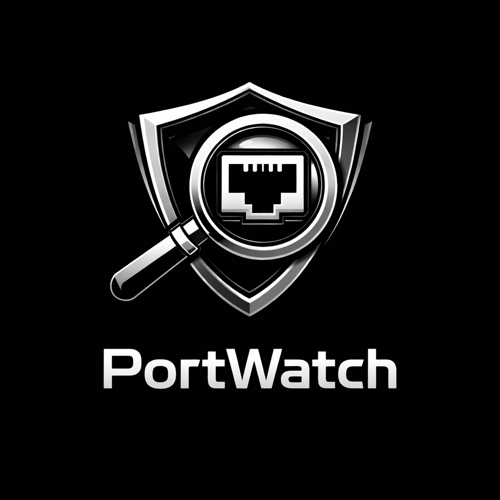

 

## ⚠️ Important Notice

**PortWatch** is a network scanning tool designed for security monitoring and auditing of your own systems.  

**Please use responsibly:**
- Only scan networks and hosts that you **own or have explicit permission to test**.  
- Unauthorized scanning may be considered illegal or malicious activity in many jurisdictions.  
- The author is **not responsible** for any misuse or damage caused by this tool.  

Always follow ethical and legal guidelines when using this software.

[](https://golang.org/) 

---

## Table of Contents

- [Features](#features)  
- [Installation](#installation)  
- [Usage](#usage)  
  - [Scan a single host](#scan-a-single-host)  
  - [Scan a host with a custom port range](#scan-a-host-with-a-custom-port-range)  
  - [Scan an entire network](#scan-an-entire-network)  
- [Example Output](#example-output)  
- [Configuration](#configuration)  
- [How It Works](#how-it-works)
- [Bugs](#bugs)

---

## Features

- Scan a single host or an entire network (CIDR notation, e.g., `192.168.1.0/24`)  
- Detect open TCP ports in a configurable range  
- Identify common services (HTTP, SSH, MySQL, etc.)  
- Alert if a new port appears compared to the previous scan  
- Save scan results to `baseline.json` for change tracking  
- Concurrent scanning for faster performance  
- Configurable timeouts and port ranges  

---

## Installation

Clone this repository:

```bash
git clone https://github.com/AraVraelHalt/PortWatch.git
cd PortWatch
```

---

## Usage
### Scan a single host
```bash
./port-watch --ip 192.168.1.1
```
### Scan a host with a custom port range
```bash
./port-watch --ip 192.168.1.1 --start 1 --end 5000
```
### Scan an entire network
```bash
./port-watch --network 192.168.1.0/24 --start 20 --end 1024
```

---

## Example Output
```js
192.168.1.1 → Open port 22 (SSH)
192.168.1.1 → Open port 80 (HTTP)
⚠️ ALERT: New open port detected → 8080
Open ports: [22, 80, 8080]
```

--- 

## Configuration

- `baseline.json`: automatically created to store previous scan results

- `--start / --end`: define port scanning range (default 1–1024)

- `--ip or --network`: target host or network

- Timeout for port scanning is currently 400ms (adjustable)

--- 

## How It Works

1. Loads previous scan results from `baseline.json`

2. Scans the target host(s) for open TCP ports

3. Compares results to the baseline and displays alerts for new ports

4. Saves the current scan as the new baseline

5. Concurrency is achieved using goroutines with a worker pool so multiple ports are scanned simultaneously for speed

---

## Bugs

If you encounter any bugs or unexpected behavior while using this project, please follow these steps:

1. **Check existing issues** – Before reporting, see if the issue has already been reported in the [Issues](https://github.com/AraVraelHalt/PortWatch/issues) section.
2. **Provide detailed information** – Include:
   - Steps to reproduce the bug
   - Expected behavior vs actual behavior
   - Screenshots or logs, if applicable
   - Your environment (OS, version, dependencies)
3. **Report a new issue** – If it hasn’t been reported, create a new issue in the repository with all relevant information.

We appreciate your help in improving this project! 🚀
